# SkateArm

**A two-armed robot you can drive from your browser — first as a 3D simulation, then, with one switch, the real [R.Botic Skate](https://www.rboticlabs.com/shop/p/skate-upper-body-v2).**

*An open bimanual work-cell & tool ecosystem: two-handed assembly with in-cell quality inspection, built sim-first in MuJoCo, then deployed over the robot's native UDP wire.*

<div align="center">
  <a href="https://dsl-robotics.github.io/skatearm/">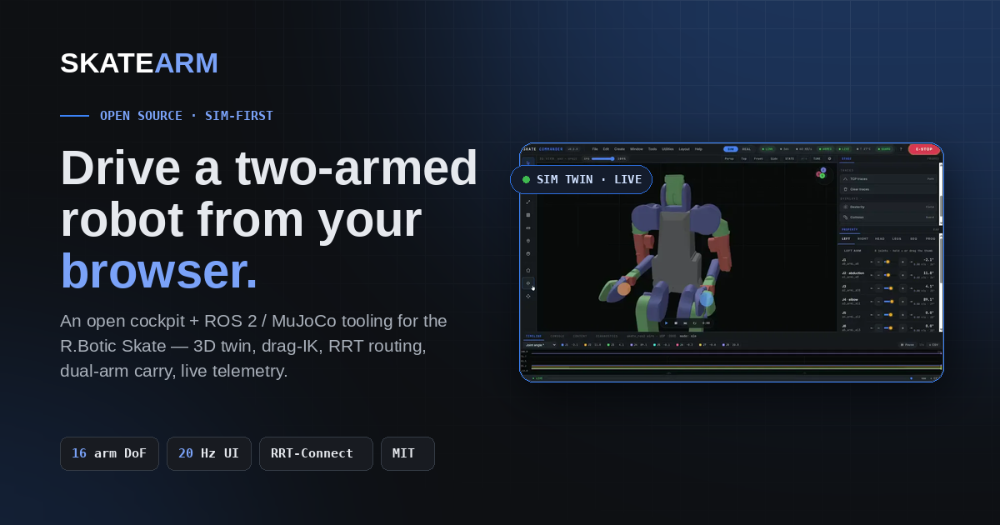</a>
</div>

<div align="center">

[](LICENSE)
[](sim/)
[](tools/skate_ros2/)
[](sim/)
[](https://github.com/dsl-robotics/skatearm/actions/workflows/tests.yml)

</div>

<div align="center">

**▶ Watch the 50-second product video** — a full tour of the cockpit: digital twin, drag-IK, mirror mode and teach-in *(recorded on an earlier UI — the cockpit has since been redesigned)*.

🌐 **Live demo & write-up → [dsl-robotics.github.io/skatearm](https://dsl-robotics.github.io/skatearm/)**

🕹 **Try the cockpit in your browser — no install → [live preview](https://raw.githack.com/dsl-robotics/skatearm/main/tools/skate_commander/preview.html)** *(runs on recorded telemetry)*

</div>

<div align="center">
  <a href="https://github.com/dsl-robotics/skatearm/blob/main/docs/video/commander_v06_product.mp4">
    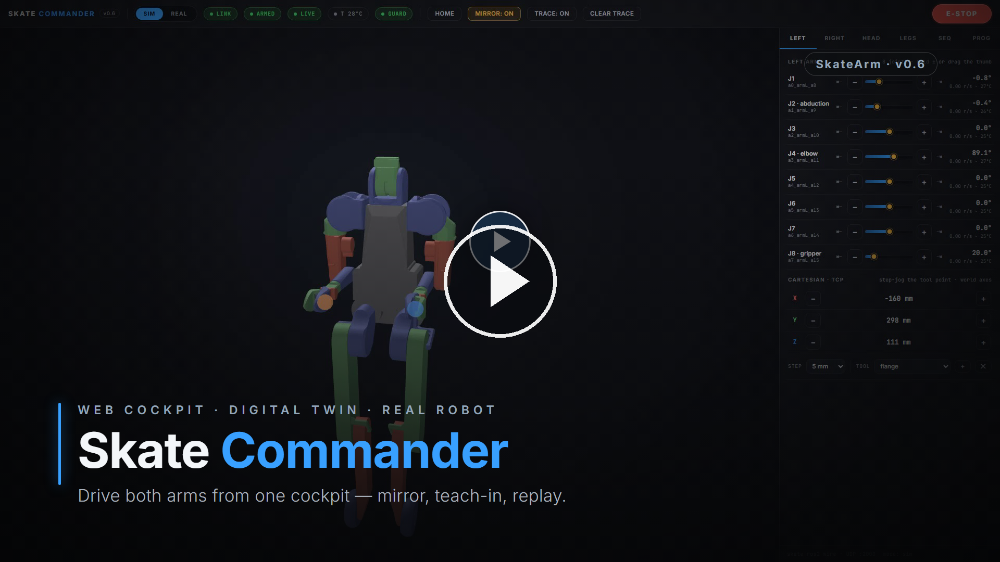
  </a>
</div>

<div align="center">
  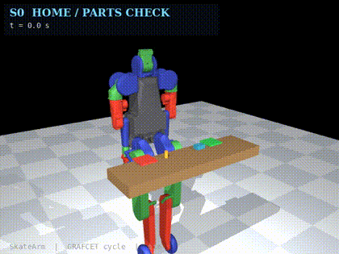
  
  <br>
  <em>Left: <strong>Phase 1 complete</strong> — the autonomous bimanual assembly cycle (GRAFCET sequencer, camera QC).
  Right: <strong>Skate Commander</strong> — mirror-mode bimanual jog, then teach-in: move the arms by hand and the cockpit writes the <code>rbt</code> program itself.</em>
</div>

## What are you here for?

| You want to… | Go to |
|---|---|
| Drive the robot (twin or real) from a browser | [🕹 Skate Commander](#-skate-commander--web-cockpit) |
| Connect a ROS 2 stack to a Skate | [🔌 skate_ros2](#-skate_ros2--the-wire) |
| See the autonomous assembly cell | [🏭 Work-cell](#-autonomous-work-cell-phase-1--complete) |
| Get the control-ready model & collision layer | [🦾 Sim foundations](#-sim-foundations-phase-0) |
| Run it yourself | [🚀 Quick start](#-quick-start-simulation) |

<details>
<summary><strong>New to the jargon?</strong> A 20-second glossary (click to expand)</summary>

- **MuJoCo** — a physics simulator; the robot "lives" here virtually before any real hardware exists.
- **ROS 2** — the standard open-source middleware (the robot's "operating system").
- **URDF** — the file describing the robot's links, joints and limits.
- **FK / IK** — forward kinematics ("where the hand is for these joint angles") / inverse kinematics ("which joint angles put the hand there").
- **TCP** — tool center point: the exact tip of the tool the robot controls.
- **Jog** — nudging a joint or the tool one small step at a time (hold a button or drag a slider).
- **Digital twin** — a 3D copy of the real robot, driven by the same commands.
- **Deadman / E-STOP** — safety: motion stops if the connection goes silent or you hit emergency-stop.

</details>

## 🕹 Skate Commander — web cockpit

<div align="center">
  
</div>

> 🚧 **Early access · under active development** — v0.7.23 is sim-first; drive the twin in your browser now, real-Skate support lands with the hardware.

A browser cockpit for the Skate: a 3D digital twin built from the official URDF, driven over the **same UDP wire** the real robot speaks. Starts E-stopped, arms at the robot's measured pose, deadman drops in 0.3 s if the tab closes.

| Feature | What it does |
|---|---|
| Jog + sliders | Hold −/+, drag the thumb, or jump straight to a limit; amber = your command, azure = actual position |
| Cartesian jog | Step the TCP along world X/Y/Z in mm — server-side IK, auto-stops on arrival |
| Drag-IK | Grab a wrist sphere in 3D — server-side DLS IK (damped least squares inverse kinematics) glides all 7 arm joints |
| Singularity awareness | Live manipulability readout; a **SING** chip warns near a wrist singularity, where a small cartesian move would need huge joint speeds |
| Manipulability map | A **DEX** toggle renders a coloured point cloud of the arm's reachable workspace — warm where the arm is dexterous, blue near its singular reach limits |
| Mirror mode | Bimanual: jog/slider/IK on one arm is reflected onto the other — the sign map is *measured* from the model's FK, not guessed |
| Dual-arm carry | **CARRY** — both wrists hold one object and move together via an X/Y/Z pad, preserving their separation (a true two-handed carry) |
| Jerk-limited motion | Jog, replay and **Home** use acceleration-limited / trapezoidal profiles — motion eases in and out instead of snapping (E-STOP still stops instantly) |
| Python programs | Built-in editor + `rbt` API (`movej`/`pose`/`movel`/`home`/waypoints); **Click-to-Step** runs one motion at a time; E-STOP or any manual input kills the program |
| Natural-language programs | Describe a task in plain English — a safe **offline** parser writes the `rbt` program into the editor (AST-validated; optional LLM fallback), which you then Click-to-Step through the same guarded bridge |
| Teach-in recording | Press **● REC**, move the robot by hand — every settled pose becomes a line of `rbt` code, ready to replay |
| Waypoint sequencer | Record poses, play with pause/loop, save/load named sequences |
| Tool / TCP offsets | Named end-of-arm tools (mm offsets); FK, IK, traces and the gizmo all follow the active TCP |
| TCP traces | Colored tool-center-point trajectories drawn in the viewport |
| On-board camera | A camera view rendered from the model (MuJoCo) and streamed into the cockpit (MJPEG), switchable between viewpoints |
| Work-camera point cloud | A **PCL** toggle back-projects the work camera's depth into the twin — a coloured 3D point cloud of what it sees (table, target), the input the v0.7.11 grasp planner consumes |
| Vision-guided pick | **DETECT** finds the workspace target and back-projects its centroid to a world pose (~2 mm vs ground truth); **PICK** drives the right arm to it through the same IK + collision guard and closes the gripper |
| Smart pick (multi-object) | A **GRASP** toggle synthesises a top-down parallel-jaw grasp on the point cloud for **every** object (RANSAC removes the table, clusters the rest, fits a grasp — centre, *measured* height, footprint, yaw, width check — to each object's own geometry, rejecting the robot's own limbs). A pluggable detector labels each by **colour + shape** (opt-in YOLO backend for real objects); an object selector + **SMART** pick the chosen one by name through the IK + guard |
| Closed-loop visual servoing | **SERVO** locks the gripper onto the target *in image space* as it descends — robust to camera-calibration error (open-loop misses ~43 mm, IBVS ~5 mm in sim) |
| Collision guard | Every target checked for self-collision *before* it is sent — including along interpolated paths; capsule-fitted collision model |
| Contact reflex | A torque spike on a *stalled* arm joint (loaded but not moving — i.e. pushing into something) latches a soft-stop; clear it from the **CONTACT** chip |
| Planned routing | When a straight move (**Home** or a **waypoint** goto/play) would clip a self-collision, an RRT planner routes the arms *around* it (collision-free) instead of stalling — the legs / balance chain are left untouched |
| SIM / REAL toggle | Same protocol either way; switching always re-latches the E-STOP |

<div align="center">
  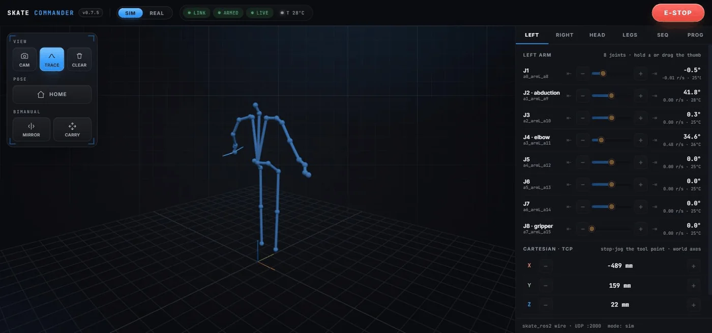
  <br>
  <em><strong>v0.7.5 cockpit</strong> — redesigned to one visual language: a slim status bar, a floating control dock (view / pose / bimanual) and the MuJoCo twin. Mirror mode, dual-arm carry, jerk-limited motion, teach-in and closed-loop visual servoing all live here.</em>
  <br><br>
  
  <br>
  <em>More cockpit in action: mirror-mode jog, cartesian TCP steps, then a Python program stepped command-by-command — watch the guard veto two of its moves. <strong><a href="https://raw.githack.com/dsl-robotics/skatearm/main/tools/skate_commander/preview.html">▶ Live preview</a></strong> (recorded telemetry, no install) · full docs: <a href="tools/skate_commander/">tools/skate_commander/</a></em>
</div>

## 🔌 skate_ros2 — the wire

A ROS 2 driver over Skate's **native UDP protocol** (documented packet layout, deadman semantics, 26-DoF ordering) plus a **MuJoCo sim endpoint speaking the same protocol** — develop your stack before the robot arrives, then swap `127.0.0.1` for `r.local`. Safety mirrors the firmware: arm-at-measured-pose, command-freshness deadman, 58 °C overtemp latch. 17 unit tests run without ROS; end-to-end verified over real sockets.

<div align="center">
  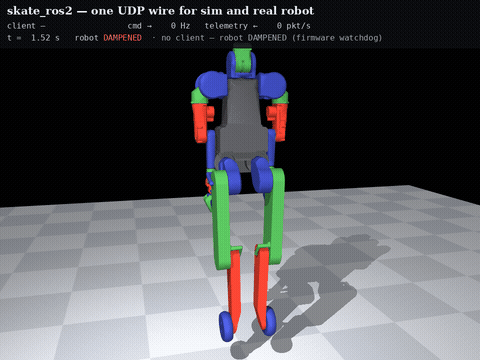
  <br>
  <em>A scripted client drives the MuJoCo endpoint over <strong>real UDP packets</strong>. At t = 11 s it goes silent — the watchdog dampens the robot.
  HD video: <a href="docs/video/ros2_wire_demo.mp4">ros2_wire_demo.mp4</a></em>
</div>

| On the wire (sim endpoint) | Result |
|---|---|
| Command rate | 60 Hz sustained (configured target) |
| Telemetry | ~190 packets/s |
| Tracking error | 0.015 rad (vs the MuJoCo model) |
| Watchdog dampen after silence | < 0.3 s (configured timeout) |

*These are sim-endpoint figures: command rate and watchdog timeout are configured targets confirmed in simulation, and tracking error is against the MuJoCo model. Real-hardware numbers come once the Skate reaches Riga.*

<div align="center">
  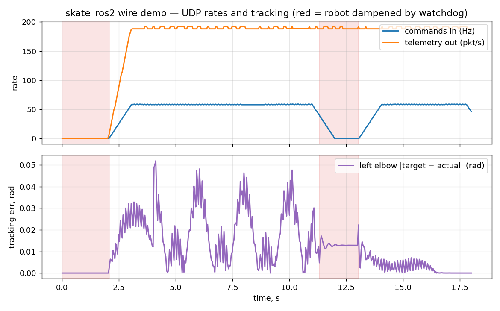
  <br>
  <em>Rates & tracking from the demo run · full docs: <a href="tools/skate_ros2/">tools/skate_ros2/</a></em>
</div>

## 🏭 Autonomous work-cell (Phase 1 — complete)

The demonstrator task, end to end in simulation: the left arm fixtures a base part in the air, the right arm aligns a peg by relative servoing and inserts it with a force-guarded descent. A GRAFCET sequencer (the IEC step-sequencer standard used in industrial soft-PLCs) runs the full cycle on sensor-based transitions — no timers — and two fixed cameras with classical CV deliver the accept/reject verdict that drives it. Every transition is logged to JSON and fed into a Flask + SQLite SCADA dashboard.

<div align="center">
  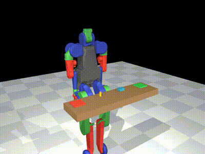
  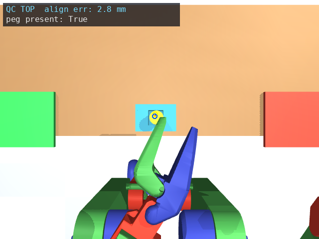
  <br>
  <em>Left: the bimanual insert (τ-watchdog guarded, depth 18.5 mm, peg tilt ≤ 2°). Right: the overhead QC camera's annotated verdict.
  HD video: <a href="docs/video/cell_cycle_demo.mp4">cell_cycle_demo.mp4</a> · <a href="docs/video/cell_assemble_demo.mp4">cell_assemble_demo.mp4</a></em>
</div>

| Key number | Result |
|---|---|
| Cycle time | **42.4 s** (takt target ≤ 60 s) |
| QC residual, alignment (camera vs sim oracle) | ±1.3 mm |
| QC residual, insertion depth | ±3.4 mm |
| Accept rate | functional — only 2 cycles logged so far (sample too small for a true rate; tracked live on the dashboard) |

Dashboard live previews: **[overview](https://raw.githack.com/dsl-robotics/skatearm/main/dashboard/preview_overview.html)** · **[cycle detail](https://raw.githack.com/dsl-robotics/skatearm/main/dashboard/preview_cycle.html)** — code in [dashboard/](dashboard/), sequencer in [sim/sequencer.py](sim/sequencer.py), QC in [sim/qc.py](sim/qc.py).

## 🦾 Sim foundations (Phase 0)

The converted official `skt_v3` model ships with no actuators — [sim/make_control_model.py](sim/make_control_model.py) adds 26 position servos and holds poses under physics with < 0.03 rad error; [sim/make_collision_model.py](sim/make_collision_model.py) replaces the jamming raw meshes with auto-fitted collision capsules (boxes via `--boxes`), so self-collision actually works. Joint/torque sensors and end-effector sites seed the telemetry schema ([tracking plot](docs/img/sensor_tracking.png)). Honest limitations documented in [sim/README.md](sim/README.md).

<div align="center">
  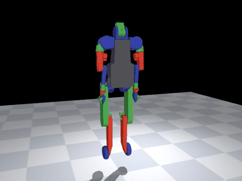
  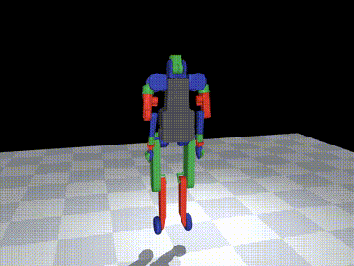
  <br>
  <em>Left: closed-loop control under physics. Right: hands meet and <strong>stop</strong> — orange boxes are the collision layer.
  HD video: <a href="docs/video/control_demo.mp4">control_demo.mp4</a> · <a href="docs/video/collision_demo.mp4">collision_demo.mp4</a></em>
</div>

## 🏗 Architecture

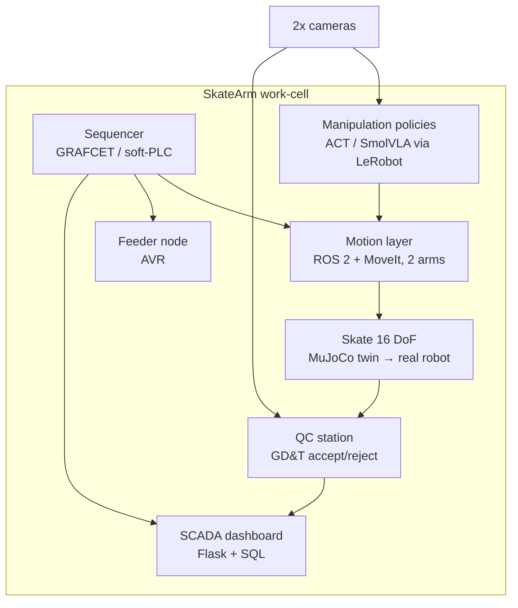

**Demonstrator task:** one arm holds/fixtures a part, the other inserts (peg-in-hole class), then in-cell measurement decides accept/reject and logs to the dashboard. The real Skate (16 DoF, span 1615 mm, RPi 5, UDP control) is en route to Riga — Phase 2 starts on arrival; `skate_ros2` is already waiting for it.

Full architecture & mapping of all 12 prior portfolio projects onto subsystems: [docs/ARCHITECTURE.md](docs/ARCHITECTURE.md). Phased plan: [docs/ROADMAP.md](docs/ROADMAP.md).

## 🚀 Quick start (simulation)

```bash
git clone https://github.com/Rbotic/skate_teleop.git   # official model (skt_v3)
pip install mujoco numpy imageio
python sim/render_skate.py --model path/to/skate_teleop/skt_v3         # static renders
python sim/make_control_model.py path/to/skate_teleop/skt_v3           # + actuators & sensors
python sim/make_collision_model.py path/to/skate_teleop/skt_v3         # + collision capsules
python sim/demo_wave.py --model path/to/skate_teleop/skt_v3            # control demo (mp4/gif)
python sim/demo_selfcollision.py --model path/to/skate_teleop/skt_v3   # self-collision demo
python sim/telemetry_demo.py --model path/to/skate_teleop/skt_v3       # tracking/torque plot
```

> **Windows:** use `py` instead of `python`/`python3` (the bare names may open the Microsoft Store stub).

Each script is documented in [sim/README.md](sim/README.md). To drive the twin from a browser, follow the [Commander quick start](tools/skate_commander/#quick-start-no-hardware).

## 🧰 Community tools

Tools get built because SkateArm needs them — then released standalone:

| Tool | What it is | Status |
|---|---|---|
| [`skate_ros2`](tools/skate_ros2/) | ROS 2 bridge over Skate's native UDP + protocol-true MuJoCo sim endpoint | ✅ **shipped** (sim-verified; MoveIt config next) |
| [`skate_commander`](tools/skate_commander/) | Web cockpit — browser digital twin, jog/sliders, **drag-IK**, cartesian jog, **mirror mode**, **dual-arm carry**, **singularity (SING) warning**, **jerk-limited motion**, **Python programs with Click-to-Step**, **teach-in recording**, waypoint **sequencer**, TCP tools & traces, **closed-loop visual servoing (SERVO)**, **contact reflex**, smooth **Home** + **waypoint moves** that **plan around self-collisions (RRT)**, **manipulability heat-map**, **work-camera point cloud**, **multi-object smart-pick (SMART) + colour/shape detector**, **ghost-robot move preview + approval gating**, **saveable view presets**, **ego + exo split view**, **real link RTT + bandwidth**, **collision guard**, **keyboard / screen-reader a11y**, **operator hotkeys + legend**, **Isaac-Sim-style application shell** (menu bar, Stage hierarchy, Property inspector, timeline, nav gizmo), **live telemetry plots** (Foxglove-style strip charts), **live TF frame tree + 3D axis triads** (RViz-style), **drag-gizmo snap + on-drag coordinate HUD**, **global speed override** (teach-pendant) · [live preview](https://raw.githack.com/dsl-robotics/skatearm/main/tools/skate_commander/preview.html) | ✅ **v0.7.23** (real-camera passthrough waits for hardware) |
| Control-ready MJCF | skt_v3 with actuators, ready for control work | ✅ first version in [sim/](sim/) |
| Teleop dataset hub | Bimanual datasets in LeRobot format | planned |
| MuJoCo benchmark suite | Repeatable bimanual tasks for policy comparison | planned |
| URDF/config validator | Sanity-check tool for Skate configs | planned |
| Getting-started handbook | From unboxing to first teleop | planned |

Ideas and requests from other Skate owners are welcome — open an issue.

**Why this project:**
1. **Level up in robotics** — from a single SO-101 arm ([previous project](https://github.com/Lavs-Daniels-Skots-231RMC173/so101-native-ubuntu-ros2-moveit)) to a bimanual humanoid: two-arm coordination, sim-to-real.
2. **Learn by building** — ROS 2, MuJoCo, policy learning (ACT/SmolVLA), classical control, embedded in one system.
3. **Give back to the Skate community** — first-mover window to publish open tools, datasets and guides others can build on.

## 🔗 Related projects

- **[SO-101 · ROS 2 + MoveIt real-hardware bring-up](https://github.com/Lavs-Daniels-Skots-231RMC173/so101-native-ubuntu-ros2-moveit)** — a real SO-101 / SO-ARM101 arm pair brought up on ROS 2 Jazzy + MoveIt + LeRobot (a 2-camera ACT policy trained and published to Hugging Face).
- **[Engineering Portfolio](https://github.com/Lavs-Daniels-Skots-231RMC173/engineering-portfolio)** — 11 academic & applied projects: industrial robotics, PLC, embedded systems, metrology, CNC, mechanical design.

## Author

**Daniels Skots Lavs** — mechatronics student (RTU), industrial electronics technician.
[GitHub profile](https://github.com/Lavs-Daniels-Skots-231RMC173) · [Engineering portfolio](https://github.com/Lavs-Daniels-Skots-231RMC173/engineering-portfolio) · porche121004@gmail.com

## License

MIT — see [LICENSE](LICENSE). The `skt_v3` model and meshes belong to [Rbotic/skate_teleop](https://github.com/Rbotic/skate_teleop) and are **not** redistributed here.
