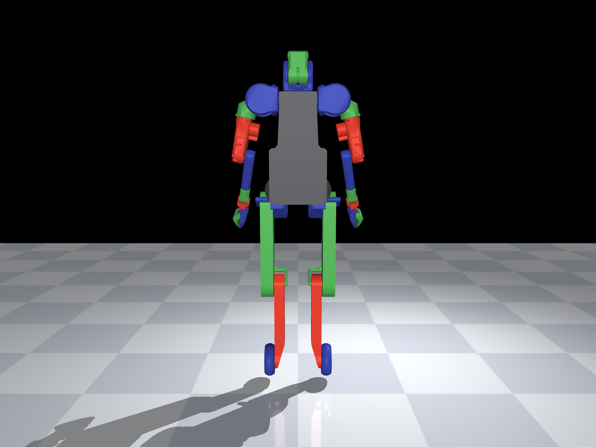
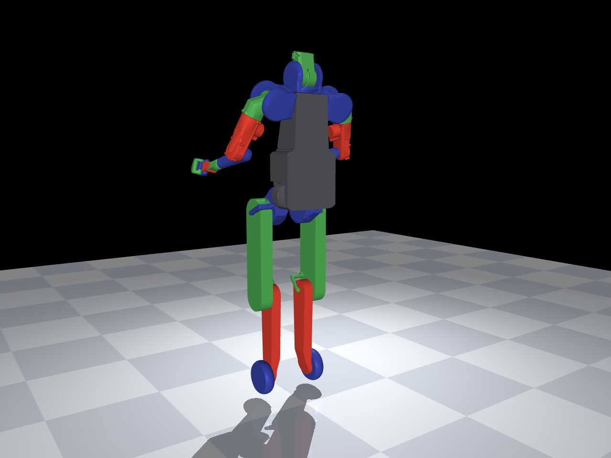
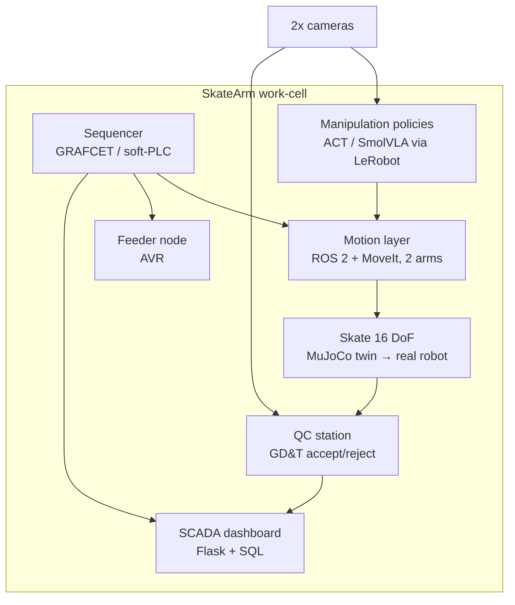

# SkateArm

**An open bimanual work-cell and tool ecosystem for the [R.Botic Skate](https://www.rboticlabs.com/shop/p/skate-upper-body-v2) robot.**

> Two arms, one cell: AI-driven two-handed small-parts assembly with in-cell quality inspection — built sim-first in MuJoCo, then deployed on the real Skate. Along the way, every reusable piece is released as an open tool for the Skate community.

<div align="center">
  
  
  <br>
  <em>The official skt_v3 digital twin running in MuJoCo (Phase 0 — sim is up).</em>
</div>

---

## Status

**Phase 0 — complete** (sim foundations, no hardware needed):
- ✅ Official `skt_v3` model (URDF + MJCF from [Rbotic/skate_teleop](https://github.com/Rbotic/skate_teleop)) loads and renders in MuJoCo 3.x — 16 arm DoF (8 per arm) + 2 head + lower chain, 26 joints total
- ✅ Posable digital twin with floor/lighting scene patch ([sim/](sim/))
- ✅ **Control-ready MJCF** — the converted model ships with no actuators (`nu=0`); [sim/make_control_model.py](sim/make_control_model.py) adds 26 position servos + damping, fixes the base, and holds poses under physics with < 0.03 rad error ([sim/](sim/#control-ready-model))
- ✅ **Primitive collision geometry** — [sim/make_collision_model.py](sim/make_collision_model.py) replaces the jamming raw meshes with auto-generated collision boxes + home-pose excludes; self-collision works (hands meet and stop — see clip below)
- ✅ **Sensors + telemetry** — joint pos/vel/torque + end-effector sites in the model; [sim/telemetry_demo.py](sim/telemetry_demo.py) logs and plots tracking/torques ([docs/img/sensor_tracking.png](docs/img/sensor_tracking.png)) — the schema seeds the future SCADA dashboard
- ✅ **Demonstrator task spec v1 (approved)** — bimanual peg-in-hole + in-cell QC, GRAFCET cycle, metrics ([specs/demo_task_spec.md](specs/demo_task_spec.md))

**Phase 1 — complete (sim work-cell):**
- ✅ **Work-cell scene** — table, base part (60×40×25 mm, spec masses), peg Ø20×40, accept/reject bins as free bodies with physics ([sim/make_cell_scene.py](sim/make_cell_scene.py))
- ✅ **Bimanual REACH primitive** — closed-loop weighted-DLS IK through the position actuators (no qpos teleports), smoothstep target gliding, collision-aware routes; motion-quality lessons documented in [sim/README.md](sim/README.md)
- ✅ **PICK & PLACE** — both hands grasp the base part and peg, carry them off the table and place them back ([sim/demo_cell_pick.py](sim/demo_cell_pick.py)); grasp is a documented weld stand-in until the real gripper geometry is known
- ✅ **FULL BIMANUAL ASSEMBLY** — the demonstrator task's manipulation core: left arm fixtures the base part in the air, right arm aligns the peg over the pocket by relative servoing and inserts it with a force-guarded descent (τ watchdog); insertion depth 18.5 mm, peg tilt ≤2°, the assembled unit is placed back on the table intact ([sim/demo_cell_assemble.py](sim/demo_cell_assemble.py))
- ✅ **GRAFCET SEQUENCER — full automatic cycle** — soft-PLC step engine with sensor-based receptivities (no timers, per the spec): parts check → grasp → carry → align → guarded insert → QC verify → ACCEPT/REJECT bin → home. **Cycle time 42.4 s** (takt target ≤ 60 s); every transition logged to [logs/cycle_001.json](logs/cycle_001.json) — the seed of the SCADA dashboard ([sim/sequencer.py](sim/sequencer.py), [sim/demo_cell_cycle.py](sim/demo_cell_cycle.py))
- ✅ **QC CAMERA PIPELINE** — two fixed inspection cameras (overhead + lateral) with classical CV: color segmentation in a fixed inspection window, pocket-rim alignment reference, px→mm from camera geometry. Camera verdict drives the sequencer's accept/reject; the sim pose oracle stays as a logged cross-check — **residuals: alignment ±1.3 mm, depth ±3.4 mm** ([sim/qc.py](sim/qc.py), annotated views in [docs/img/14_qc_top_annotated.png](docs/img/14_qc_top_annotated.png))
- ✅ **CELL DASHBOARD** — Flask + SQLite SCADA monitor over the sequencer logs: accept rate, cycle-time trend vs takt, camera-vs-oracle QC residuals, per-cycle GRAFCET timeline ([dashboard/](dashboard/) · **[live preview](https://raw.githack.com/Lavs-Daniels-Skots-231RMC173/skatearm/main/dashboard/preview_overview.html)** · [cycle detail](https://raw.githack.com/Lavs-Daniels-Skots-231RMC173/skatearm/main/dashboard/preview_cycle.html))
- ✅ **`skate_ros2` — the first standalone community tool** ([tools/skate_ros2/](tools/skate_ros2/)): ROS 2 driver over Skate's **native UDP protocol** (documented packet layout, deadman semantics, 26-DoF ordering) + a **MuJoCo sim endpoint speaking the same protocol** — develop your ROS 2 stack before the robot arrives, then swap `127.0.0.1` for `r.local`. Safety mirrored from firmware: arm-at-measured-pose, command-freshness deadman, 58 °C overtemp latch. 17 unit tests run without ROS (stubbed rclpy); e2e verified over real sockets: 60 Hz commands, ~190 telemetry pkt/s, 0.015 rad tracking, watchdog dampen < 0.3 s

<div align="center">
  
  <br>
  <em>Phase 1: the full automatic cycle under the GRAFCET sequencer — HMI overlay shows the live step and sensor metrics; QC verdict ACCEPT, unit placed on the green bin.
  HD video: <a href="docs/video/cell_cycle_demo.mp4">cell_cycle_demo.mp4</a> · <a href="docs/video/cell_assemble_demo.mp4">cell_assemble_demo.mp4</a></em>
</div>

<div align="center">
  
  <br>
  <em><code>skate_ros2</code>: a scripted client drives the MuJoCo endpoint over <strong>real UDP packets</strong> — the exact wire format the physical Skate accepts. At t=11 s the client goes silent; the firmware-style watchdog dampens the robot in 0.3 s.
  HD video: <a href="docs/video/ros2_wire_demo.mp4">ros2_wire_demo.mp4</a> · wire stats: <a href="docs/img/ros2_wire_stats.png">rates & tracking</a></em>
</div>

<div align="center">
  
  
  <br>
  <em>Left: closed-loop control — independent arm trajectories under physics.
  Right: self-collision — hands meet and <strong>stop</strong>; orange boxes are the auto-generated collision layer.<br>
  HD video: <a href="docs/video/control_demo.mp4">control_demo.mp4</a> · <a href="docs/video/collision_demo.mp4">collision_demo.mp4</a></em>
</div>

The real Skate (assembled, 16 DoF, span 1615 mm, RPi 5 on board, UDP control) is en route to Riga — Phase 2 starts when it arrives. The `skate_ros2` bridge is already waiting for it: swap the sim endpoint's IP for `r.local` and the same stack drives the real robot.

## Why this project

1. **Level up in robotics** — from a single SO-101 arm ([previous project](https://github.com/Lavs-Daniels-Skots-231RMC173/so101-native-ubuntu-ros2-moveit)) to a bimanual humanoid: two-arm coordination, complex manipulation, sim-to-real.
2. **Learn by building** — ROS 2, MuJoCo, policy learning (ACT/SmolVLA), classical control, all embedded in one system.
3. **Give back to the Skate community** — Skate is brand-new; first-mover window to publish open tools, datasets and guides other enthusiasts can build on.

## Architecture



**Demonstrator task:** one arm holds/fixtures a part, the other inserts (peg-in-hole class), then in-cell measurement decides accept/reject and logs to the dashboard.

Full architecture and the mapping of all 12 prior portfolio projects onto subsystems: [docs/ARCHITECTURE.md](docs/ARCHITECTURE.md). Phased plan: [docs/ROADMAP.md](docs/ROADMAP.md).

## Quick start (simulation)

```bash
git clone https://github.com/Rbotic/skate_teleop.git   # official model (skt_v3)
pip install mujoco numpy imageio
python sim/render_skate.py --model path/to/skate_teleop/skt_v3         # static renders
python sim/make_control_model.py path/to/skate_teleop/skt_v3           # + actuators & sensors
python sim/make_collision_model.py path/to/skate_teleop/skt_v3         # + collision boxes
python sim/demo_wave.py --model path/to/skate_teleop/skt_v3            # control demo (mp4/gif)
python sim/demo_selfcollision.py --model path/to/skate_teleop/skt_v3   # self-collision demo
python sim/telemetry_demo.py --model path/to/skate_teleop/skt_v3       # tracking/torque plot
```

Each script is documented in [sim/README.md](sim/README.md), including what the generated models contain and the honest limitations (AABB collision boxes, contacts vs mount overlaps).

## Community tools track

Tools get built because SkateArm needs them — then released standalone:

| Tool | What it is | Status |
|---|---|---|
| [`skate_ros2`](tools/skate_ros2/) | ROS 2 bridge over Skate's native UDP + protocol-true MuJoCo sim endpoint | ✅ **shipped** (sim-verified; MoveIt config next) |
| Control-ready MJCF | skt_v3 with actuators, ready for control work | ✅ first version in [sim/](sim/) |
| Teleop dataset hub | Bimanual datasets in LeRobot format | planned |
| MuJoCo benchmark suite | Repeatable bimanual tasks for policy comparison | planned |
| URDF/config validator | Sanity-check tool for Skate configs | planned |
| Getting-started handbook | From unboxing to first teleop | planned |

Ideas and requests from other Skate owners are welcome — open an issue.

## Author

**Daniels Skots-Lavs** — mechatronics student (RTU), industrial electronics technician.
[GitHub profile](https://github.com/Lavs-Daniels-Skots-231RMC173) · [Engineering portfolio](https://github.com/Lavs-Daniels-Skots-231RMC173/engineering-portfolio) · porche121004@gmail.com

## License

MIT — see [LICENSE](LICENSE). The `skt_v3` model and meshes belong to [Rbotic/skate_teleop](https://github.com/Rbotic/skate_teleop) and are **not** redistributed here.
