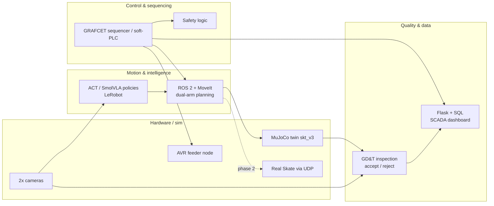

# SkateArm — Architecture

## The cell at a glance

An AI-driven bimanual work-cell built around the R.Botic Skate (16 DoF, 8 per arm, ~3 kg bimanual payload, RPi 5 on board, UDP over Ethernet/Wi-Fi). Demonstrator task: **two-handed small-parts assembly + in-cell GD&T quality inspection**.

Sim-first: everything runs against the MuJoCo twin until the real Skate arrives in Riga; the motion layer then switches target via the (to-be-built) `skate_ros2` UDP bridge.

## Mapping: 12 portfolio projects → subsystems

| # | Prior project | Becomes |
|---|---|---|
| 1 | WPL station (RTK 4.7) | Cell layout, takt-time design |
| 2 | Metrology / shaft detail (GD&T, Mitutoyo) | QC inspection station, accept/reject criteria |
| 3 | Robotic manufacturing cell (RAPID) | Dual-arm task structuring, motion primitives |
| 4 | Automated drilling machine PLC | GRAFCET sequencer + safety logic |
| 5 | Electronics coursework / Latvijas Finieris job | Power distribution, wiring, troubleshooting |
| 6 | Engineering drawing (CAD) | Fixtures, jigs, cell frame |
| 7 | Programming coursework (Python/SQL/Flask) | SCADA dashboard |
| 8 | Belt drive calculation (Jupyter) | Engineering load/torque analysis |
| 9 | CNC milling G-code | Machined fixture parts |
| 10 | AVR microcontroller (Proteus) | Feeder node firmware |
| 11 | FESTO MPS maintenance (EPLAN) | Electrical schematics, tagging, handbook |
| 12 | SO-101 ROS 2 + MoveIt (real hardware) | Motion layer foundation + lessons (calibration chains, sim≠real) |

## Key design constraints

- **Solo + sim-first.** The official MuJoCo twin makes Phase 0–1 fully doable before hardware arrives.
- **Honest claims.** Same rule as the SO-101 project: a green RViz state is not proof the real robot is safe — every sim-to-real transition gets validated joint-by-joint.
- **Tools fall out of the build.** Anything reusable (bridge, validator, datasets, benchmarks) is split into a standalone community tool.
- **Dual purpose.** The same work serves as an open flagship and as RTU capstone/thesis material; the technical report is a byproduct of docs kept in this repo.

## Open questions (tracked)

- Actuator model for the control-ready MJCF (position servos vs torque + PD).
- Demonstrator part geometry (peg-in-hole tolerance class) — see [../specs/demo_task_spec.md](../specs/demo_task_spec.md).
- RTU supervisor involvement timing.
