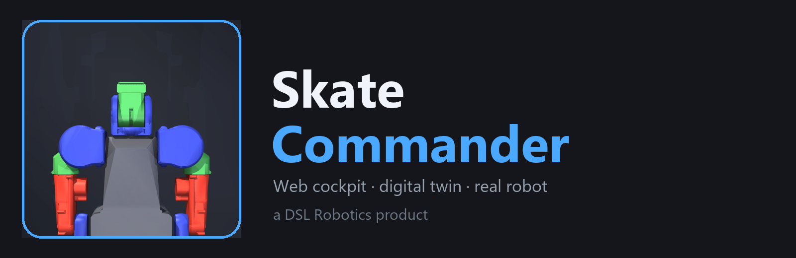
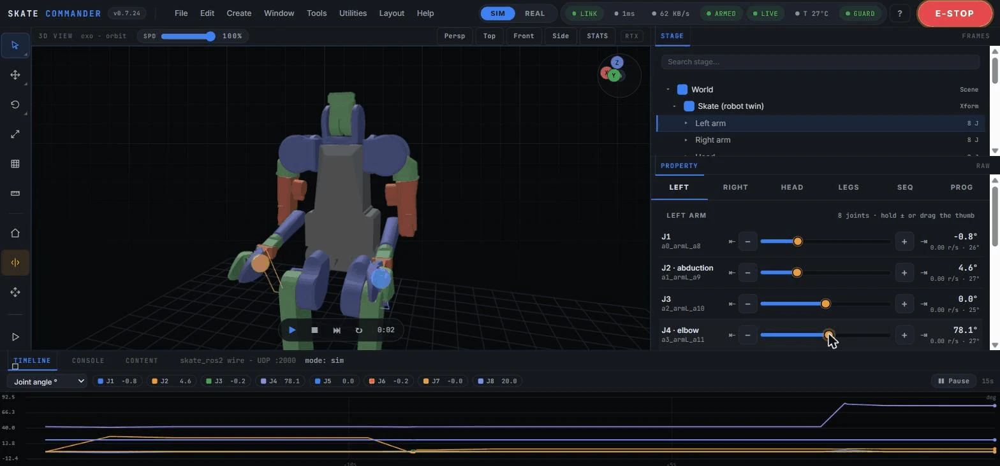
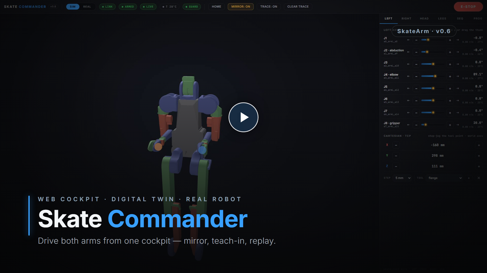
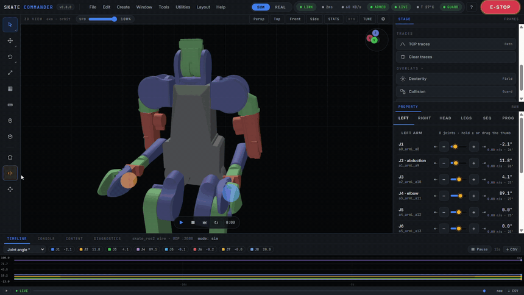
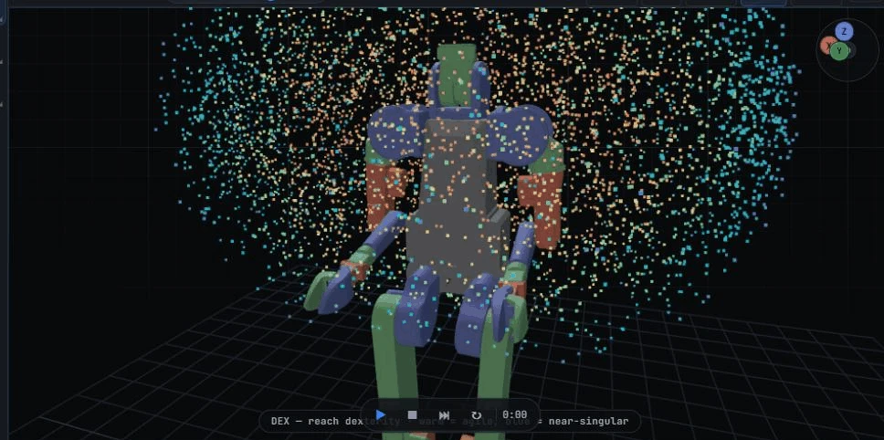
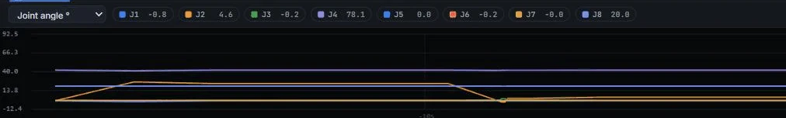
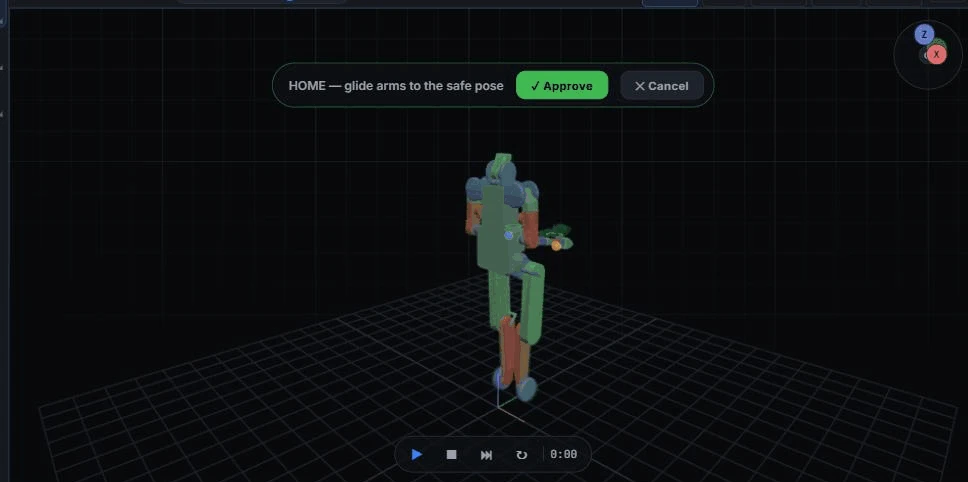

<p align="center">
  
</p>

# Skate Commander — web cockpit for the Skate digital twin & robot


> 🚧 **Early access · under active development.** Sim-first today — drive the digital twin in your browser right now; real-Skate support flips on when the hardware reaches Riga.

Drive the [SkateArm](../../README.md) digital twin from a browser — and, when
the hardware lands, flip one switch and drive the real Skate over the exact
same UDP wire. Functional reference: PAROL6's Waldo Commander; the design,
the bimanual specifics and the safety model are our own.

**[▶ Live preview](https://raw.githack.com/dsl-robotics/skatearm/main/tools/skate_commander/preview.html)** —
recorded telemetry playback, no install (simplified stick-figure twin there:
Rbotic's STL meshes are only loaded from your local clone, never
redistributed).

📖 **Docs & `rbt` API reference → [dsl-robotics.github.io/skatearm/commander.html](https://dsl-robotics.github.io/skatearm/commander.html)**

<div align="center">
  
  <br>
  <em><strong>v0.8.0 cockpit</strong> — an Isaac-Sim-style workstation: a menu bar, a left tool rail, the 3D MuJoCo twin, a STAGE / PROPERTY dock and live telemetry plots.</em>
</div>

<div align="center">
  <a href="https://github.com/dsl-robotics/skatearm/blob/main/docs/video/commander_v06_product.mp4">
    
  </a>
  <br>
  <em>▶ <strong>Watch the 50-second product tour</strong> — captions, music, and zoom-to-control highlights (click to play on GitHub).</em>
</div>

<div align="center">
  
  <br>
  <em><strong>v0.8.0 cockpit in action</strong> — mirror mode drives both arms from one slider while the live telemetry plots track the motion.</em>
</div>

<div align="center">
<table>
  <tr>
    <td width="50%"><br><sub><b>Manipulability cloud</b> — warm where dexterous, blue near singular reach</sub></td>
    <td width="50%"><br><sub><b>Live telemetry plots</b> — angle / velocity / temperature / TCP / RTT at 30 Hz</sub></td>
  </tr>
  <tr>
    <td width="50%"><br><sub><b>Isaac-Sim-style workstation</b> — menu bar, tool rail, Stage / Property dock, timeline</sub></td>
    <td width="50%"><br><sub><b>Ghost preview</b> — risky moves wait behind an Approve / Cancel gate</sub></td>
  </tr>
</table>
</div>

## Features (v0.8.0)

The cockpit is structured as a NVIDIA-Isaac-Sim-style workstation: a **menu bar**, a left vertical **tool rail**, a center **3D View**, a right **STAGE** (scene hierarchy) over **PROPERTY** (inspector), and a bottom **TIMELINE / CONSOLE / CONTENT** browser - on a flat, token-driven dark theme.


* **Live telemetry plots** (Foxglove / PlotJuggler style) — the TIMELINE pane
  plots real scrolling strip charts of the live signals (joint angle /
  velocity / temperature / TCP / link RTT) at 30 Hz, with a colour-coded
  legend, click-to-toggle lines, pause and current-value end markers
* **Live TF frame tree** (RViz2 style) — the FRAMES tab is a live transform
  tree (world ▸ base_link ▸ armL/armR_flange) with world-mm readouts and
  eye-toggled RGB axis triads (with frame-name labels) that track the kinematics
* **Global speed override** (teach-pendant) — a SPD slider scales all motion
  server-side (jog + every glide: home, sequences, RRT routes)
* **Isaac inspection tools** — a **sim transport** (Play / Pause / Step / Reset
  with real server-side pause / single-step of the autonomous motion), a
  click-two-points **measure** tool, a viewport **stats HUD** (FPS / draw-calls
  / triangles), and **Stage search** + a 3D **selection outline**
* **3D digital twin** built in-browser from the official `skt_v3.urdf`
  (Three.js; kinematic math validated against MuJoCo to < 0.001 mm; URDF
  material colors)
* **Joint control four ways** — hold −/+ to jog, **drag the slider thumb**
  (amber thumb = your command, azure fill = actual position), jump straight
  to a joint limit (⇤ ⇥, guard permitting), or grab a wrist sphere and
  **drag in 3D**: server-side damped-least-squares IK glides all 7 arm
  joints (pure numpy, 0.15 ms/step)
* **Cartesian jog** — step the TCP along world X/Y/Z (1–50 mm, hold to
  repeat) with a live TCP readout; the IK target auto-clears on arrival, or
  when it stops improving (out of reach / guard-blocked). While any IK
  target is active the redundant arm **chooses its own elbow**: a null-space
  comfort objective (documented default pose blended toward joint-range
  centers) continuously relaxes the posture *without moving the TCP* — no
  winding on out-and-back jogs, no limit-hugging
* **Mirror mode** — bimanual jog: jog/slider/IK input on one arm is
  reflected onto the other. The per-joint sign map and the mirror axis are
  **measured numerically from the model's FK at startup**, not assumed from
  URDF conventions
* **Dual-arm carry** — **CARRY** holds one object with both wrists and moves
  them together via an X/Y/Z pad, preserving the arms' natural separation (a
  true two-handed carry; the Skate can't squeeze its wrists together in x, so
  co-lifting is the feasible bimanual primitive)
* **Singularity awareness** — per-arm manipulability (reciprocal Jacobian
  condition number) streamed live; a **SING** chip warns when an active arm
  nears a wrist singularity, where a small cartesian move would demand huge
  joint speeds
* **Manipulability heat-map** — a **DEX** toggle samples each arm's reachable
  workspace and renders it as a colour-graded point cloud in the twin: warm
  where the arm is dexterous (isotropic), blue near its singular reach limits.
  Computed server-side from the geometric (axis × lever) Jacobian, cached
* **Work-camera point cloud** *(sim-validated; parked under "Camera tools — under development" pending a real depth camera)* — a **PCL** toggle back-projects the work
  camera's rendered depth into the twin as a coloured point cloud (each point
  takes its RGB pixel's colour): a live 3D reconstruction of what the camera
  sees (table, target). The magenta cube reconstructs to ~2 mm of ground truth
  — the input the grasp planner below consumes
* **Smart pick — grasp synthesis on the cloud** *(sim-validated; parked under "Camera tools — under development")* — a **GRASP** toggle turns the
  point cloud into a grasp: a RANSAC plane fit removes the table, the rest is
  clustered, and a top-down parallel-jaw grasp is fit to the object's own
  geometry — centre, a *measured* grasp height (mid plane↔top, not a hard-coded
  height), footprint + yaw (jaws close across the minor axis) and a
  gripper-width feasibility check — drawn in the twin (footprint + jaw line +
  approach). **SMART** executes it through the IK + guard. It selects the flat,
  compact object a resting part presents to the overhead camera, not the
  robot's own limbs in the cloud. **Multi-object:** every object on the table is
  found and **labelled by colour + shape** by a pluggable detector (with an
  opt-in **YOLO** backend, `SKATE_YOLO` + ultralytics, for real / COCO objects),
  so you pick **by name** — the `GRASP` overlay shows all candidates and an
  object selector + `SMART` choose which to grasp.
* **Jerk-limited motion** — jog is acceleration-limited (eases in on hold,
  eases out on release) and waypoint/replay glides **and the Home pose**
  follow a trapezoidal profile; safety stops (E-STOP / mode switch) still drop
  motion instantly
* **Contact reflex** — an unexpected torque spike on a *stalled* arm joint
  (loaded but barely moving — the signature of pushing into an obstacle, not
  of a fast commanded move) latches a soft-stop, like the overtemp latch;
  clear it from the **CONTACT** chip. Grippers are excluded so a grasp doesn't
  trip it
* **Collision-free routing** — when a direct move would clip a self-collision
  the guard won't pass (folding the elbow from the hanging pose sweeps the hand
  through the thigh), an **RRT-Connect** planner finds a path *around* it and
  the arm follows that route. **Home** and **waypoint** moves (goto / play) use
  this to reach a pose the straight glide can't; the leg / balance chain is
  never re-planned (the **ROUTING** chip shows while a route runs)
* **Python programs** — in-browser editor over a sandboxed `rbt` API
  (`movej`, `pose`, `movel`, `moveto`, `home`, `gripper`, `waypoint`, `wait`,
  `tcp`, `q`, `status`; `print` goes to the cockpit log). **Click-to-Step** executes one
  motion at a time, showing the next command and its source line; RUN
  releases the program. Every motion uses the same bridge paths as the UI —
  limits, collision guard, E-STOP — and any manual input kills the program.
  Save/load to `programs/*.py`
* **Natural-language programs** — describe a task in plain English (e.g.
  *"raise both arms, then home"*) and a safe parser writes the `rbt` program
  into the editor; it never moves the robot directly — you review it, then
  Click-to-Step or RUN it through the same guarded bridge. Runs fully offline
  (a deterministic intent parser + an AST validator that only ever emits known
  `rbt` calls); an optional LLM fallback engages only if an API key is set
* **On-board camera + vision-guided pick** *(sim-validated; parked under "Camera tools — under development")* — the server renders a workspace
  camera from the model (MuJoCo) and streams it into the cockpit (MJPEG,
  switchable views). **DETECT** finds the magenta target and back-projects its
  centroid to a world pose (camera intrinsics from `fovy`, extrinsics from
  `cam_xpos`/`cam_xmat`, intersected with the table plane — validated to ~2 mm
  against the simulator's true object position); **PICK** drives the right arm
  to it via the same DLS-IK + collision guard and closes the gripper. **SERVO**
  runs the pick *closed-loop* — it drives the gripper onto the target *in image
  space* as the arm descends, so it stays on target despite camera-calibration
  error (open-loop misses ~43 mm, image-based visual servoing converges to
  ~5 mm in sim)
* **Teach-in recording** — press **● REC** and just move the robot
  (sliders, jog, gizmo, cartesian steps): every settled pose becomes a line
  of `rbt` code — `movej` for one joint, a coordinated `pose({...})` for
  several. Stop, and the generated program lands in the editor ready to
  RUN. A red REC chip in the top bar shows the pose count from any tab
* **Tool / TCP offsets** — named end-of-arm tools (mm offsets in the wrist
  frame, persisted in `tcp_tools.json`); FK, IK, the drag-gizmo, traces and
  the cartesian readout all follow the active TCP per arm
* **Waypoint sequencer** — record poses, glide through them with pause/loop,
  jump to any step, save/load named sequences (`sequences/*.json`); any
  manual input or E-STOP interrupts playback
* **TCP traces** — colored tool-point trajectories in the viewport
  (toggle/clear)
* **Collision guard** — every candidate target (jog, slider, IK, cartesian,
  sequencer, programs) is checked for self-collision *before it is sent*;
  large jumps are checked along the interpolated path (no tunneling). The
  guard sees hand↔leg pairs the physics model deliberately excludes. The
  collision model now fits **capsules** instead of AABB boxes — far fewer
  false positives on the slim wrist links (the model builder's `make_collision_model.py --boxes` flag restores the old AABB-box behavior)
* **SIM / REAL toggle** — the same `skate_ros2` UDP protocol either way;
  switching always re-latches the E-STOP; the lower chain is locked in REAL
  **at the bridge**, not just greyed out in the UI
* **Collision-mesh display** — a toggle (key **B**) renders the guard's actual
  capsule / box collision model in 3D and reddens any contacting pair, so you
  see exactly what the guard sees
* **TCP-force overlay** — a toggle (key **F**) draws a per-arm end-effector
  force arrow estimated from the joint torques (`(J·Jᵀ)⁻¹·J·τ`, position-only),
  low-pass filtered, amber when straining (> 12 N)
* **Live telemetry plots, TF tree & diagnostics** — Foxglove-style strip charts
  (angle / velocity / temperature / TCP / RTT at 30 Hz), an RViz2-style TF frame
  tree with RGB axis triads, and an RViz `robot_monitor`-style diagnostics tree
  with per-joint OK / warn / error dots
* **Trajectory replay + CSV export** — a 45 s rolling joint-motion record with a
  scrubber and Play (drag to freeze the twin in the past; a playhead tracks it on
  the plots); one-click **↓ CSV** of the current signal or the full 26-DoF trajectory
* **Joint-limit meters** — each joint's slider edge and value tint amber near a
  limit (red at the stop), with an amber bounding box on the link in 3D
* **Scene markers** — spawn a target in reachable space and drag its X/Y/Z gizmo;
  each shows live **reachability** (green / red), one-click **→L / →R** go-to,
  **→P** to append `rbt.moveto(…)` to a program, and **⇄ both** for a simultaneous
  **bimanual reach**
* **Virtual keep-out obstacles** — spawn boxes and place them freely with a 3D
  gizmo, sized to any W×D×H; the RRT planner and the collision guard route the
  arms *around* them
* **Planning preview** — before a **Home** or **waypoint** move, a translucent
  **ghost robot** shows the destination pose and a blue trail shows the planned
  collision-free **route**, gated behind **Approve / Cancel**
* **Stage hierarchy + inspector & display settings** — an Isaac-Sim-style STAGE
  tree with visibility eyes and a live PROPERTY inspector; a viewport settings
  popover (grid / axes / FOV / background / render quality); a two-point
  **measure** tool; a **stats HUD** (FPS / draw-calls / triangles); **Stage
  search** + a 3D selection outline
* **Drive / motion tuning** — a **TUNE** panel exposes the bridge's real motion
  params (jog & glide rate / accel, contact-reflex trip torque) with live effect
  and a reset
* **Global speed override** — a **SPD** slider scales all motion server-side
  (jog + every glide: home, sequences, RRT routes)
* **Sim transport** — Play / Pause / Step / Reset of the autonomous motion with a
  run clock
* **Save / load scene** — save the placed markers + obstacles to a JSON scene
  file and reload them later

## Safety model

Starts **estopped**; RESUME is an explicit human action. Arms at the robot's
**measured pose** (no jump on connect; early commands are ignored). Close the
tab → deadman drops in 0.3 s (firmware watchdog semantics). Joint limits are
clamped at the bridge; self-colliding targets never leave the server; the
lower chain is locked in REAL mode. Overtemp (58 °C) latches a whole-body
dampen.

## Quick start (no hardware)

```bash
# 1. the cockpit
git clone https://github.com/dsl-robotics/skatearm.git
cd skatearm/tools/skate_commander

# 2. the official robot model — once (meshes aren't redistributed)
git clone https://github.com/Rbotic/skate_teleop.git

# 3. install + launch
pip install -r requirements.txt mujoco
python3 -m skate_commander
```

> **Windows:** use `py -m pip install …` and `py -m skate_commander` — the bare
> `python` / `python3` / `pip` names may be missing or open the Microsoft Store stub.

On first run it auto-finds your `skate_teleop` clone, builds the control +
collision models once, starts the sim endpoint, and opens the cockpit at
**http://127.0.0.1:8088** → press **RESUME** → jog / drag / record.

Model not found automatically? Point at it (or set `$SKT_DIR`):

```bash
python3 -m skate_commander --model-dir /path/to/skate_teleop/skt_v3
```

**Real Skate:** `python3 -m skate_commander --real` (add `--real-host <ip>` if
it isn't `r.local`) — no sim is spawned and the collision guard still protects
the robot. Handy flags: `--port`, `--no-browser`, and the advanced overrides
`--spawn-sim` / `--collision-model`.

## Programming the robot

The **PROG** tab is a tiny Python environment over the same bridge (degrees
for joints, millimeters for cartesian, world axes):

```python
rbt.home()
rbt.movej("L4", 60)            # left elbow — "L1".."L8", "R…", "H…", or index
rbt.pose({"L2": 25, "R2": 25}) # several joints as ONE coordinated move
for d in (40, 80, 40):
    rbt.movej("R4", d)         # wave
rbt.movel("right", dz=60)      # TCP up 60 mm (server-side IK)
rbt.gripper("right", 30)
print("tcp:", rbt.tcp("right"), "mm")
```

Too lazy to type? Press **● REC**, drive the robot by hand, press it again —
the program writes itself from your settled poses and appends to the editor.

**⏭ STEP** (Click-to-Step) pauses before every motion command and shows the
next call + its source line; **▶ RUN** releases it. The runner is a worker
thread whose every motion goes through the bridge — collision guard, joint
limits, REAL-mode leg lock and E-STOP included; touching any manual control
stops the program. MIRROR mode applies to program moves too (it's a bridge
mode, not a UI gimmick). The sandbox has no imports or file access (`math` and
`rbt` are provided) — it's a convenience layer for a local tool, not a
security boundary.

## Architecture

```
browser (Three.js twin · sliders · gizmo · sequencer UI)
   │ WebSocket: telemetry ↓20 Hz · commands ↑
FastAPI server (skate_commander.server)
   │ RobotBridge: arming · jog/slider/IK/sequencer @60 Hz
   │              estop · overtemp · collision guard · SIM/REAL
   │ numpy kinematics (FK = MuJoCo ±0; DLS IK)
   │ skate_ros2.SkateLink — the native UDP wire
   ▼
MuJoCo sim endpoint (SIM)  /  real Skate (REAL)
```

## Tests

`test/` runs headless — every file is a plain script, **no pytest needed**:

```bash
# from tools/skate_commander; Windows: py instead of python3
SKT_DIR=/path/to/skt_v3 SKATE_MJCF=/path/to/skt_v3/skt_v3_control.xml \
    python3 test/test_kinematics.py     # FK vs MuJoCo + tool offsets
# likewise: test_urdf.py · test_bridge.py (cart-step & mirror e2e) ·
#           test_ws_e2e.py · test_guard.py · test_program.py
```

Covered: URDF parsing, the bridge safety cycle, FK/IK and tool offsets vs
MuJoCo, cartesian step + mirror reflection over real UDP, the full
WebSocket→UDP→MuJoCo loop, sequencer e2e, collision-guard e2e (leg coverage,
anti-tunneling), and the program runner (Click-to-Step, STOP, E-STOP abort,
sandbox). The whole suite runs on a plain Windows + Python 3.13 machine — no
ROS anywhere in the stack.

## Roadmap

The depth-based vision tools (work-camera point cloud, smart-pick grasp
synthesis, vision-guided pick, IBVS visual servoing) are **sim-validated today**
and parked behind the "Camera tools — under development" stub — they re-enable
with a real connected depth camera, alongside real-gripper tool presets and
on-hardware validation. Commander graduates to its own repo once it's
daily-drivable on the real Skate (v1.0).
