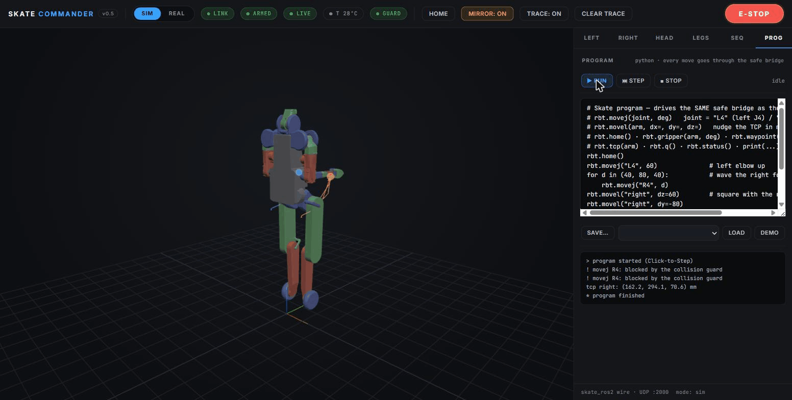

# Skate Commander — web cockpit for the Skate digital twin & robot

Drive the [SkateArm](../../README.md) digital twin from a browser — and, when
the hardware lands, flip one switch and drive the real Skate over the exact
same UDP wire. Functionally inspired by PAROL6's Waldo Commander; the design
and the bimanual specifics are our own.

**[▶ Live preview](https://raw.githack.com/Lavs-Daniels-Skots-231RMC173/skatearm/main/tools/skate_commander/preview.html)** —
recorded telemetry playback, no install needed (twin renders as a stick
figure there: STL meshes belong to Rbotic and are only loaded from your local
clone, never redistributed).



## v0.1 features

* **3D digital twin** built in-browser from the official `skt_v3.urdf`
  (Three.js; kinematic math validated against MuJoCo to < 0.001 mm)
* **Joint jog** — hold −/+ per joint, grouped LEFT ARM / RIGHT ARM / HEAD /
  LEGS, with live angle, velocity and per-motor temperature readouts
* **SIM / REAL toggle** — the same `skate_ros2` UDP protocol either way;
  SIM targets the local MuJoCo endpoint, REAL targets `r.local`
* **Safety chrome**: big E-STOP/RESUME, DAMPENED banner, overtemp chip,
  HOME glide to the documented safe pose

## Safety model (inherited from skate_ros2, plus UI rules)

* Starts **estopped and dampened**; RESUME is an explicit human action.
* Arms at the robot's **measured pose** — no jump on connect; jog input
  before arming is ignored.
* Close the tab → deadman drops within 0.3 s (firmware watchdog semantics).
* Any SIM↔REAL switch **re-latches the estop** and re-arms from telemetry.
* Switching to REAL asks for confirmation and comes up dampened.
* Jog targets are clamped to URDF joint limits at the bridge, not in the UI.
* The lower chain (legs) is **locked in REAL mode** — balance belongs to the
  firmware.

## Quick start (no hardware)

```bash
pip install -r requirements.txt mujoco
# control-ready MJCF, if you haven't generated it yet:
python3 ../../sim/make_control_model.py /path/to/skate_teleop/skt_v3

python3 -m skate_commander.server \
    --model-dir /path/to/skate_teleop/skt_v3 \
    --spawn-sim /path/to/skate_teleop/skt_v3/skt_v3_control.xml
# open http://127.0.0.1:8088 → RESUME → jog
```

With a real Skate on the network: leave out `--spawn-sim`, flip the toggle to
REAL in the UI (default robot host `r.local`, override with `--real-host`).

## Architecture

```
browser (Three.js twin + jog UI)
   │ WebSocket: telemetry ↓20 Hz · commands ↑
FastAPI server (skate_commander.server)
   │ RobotBridge: arming · jog integrator @60 Hz · estop/overtemp · mode
   │ skate_ros2.SkateLink — the native UDP wire
   ▼
MuJoCo sim endpoint (SIM)  /  real Skate (REAL)
```

The bridge and URDF layers are pure Python with no web dependencies —
`test/` runs them headless, including a full WebSocket→UDP→MuJoCo e2e.

## Tests

```bash
python3 test/test_urdf.py        # URDF→tree: 26 indexed joints, limits
SKATE_MJCF=.../skt_v3_control.xml python3 test/test_bridge.py   # safety cycle
SKATE_MJCF=.../skt_v3_control.xml python3 test/test_ws_e2e.py   # full stack
```

## Roadmap

v0.2+: cartesian drag-gizmo (reusing the work-cell's DLS IK), waypoint
sequencer with playback, TCP trajectory trace, tool/TCP-offset manager,
camera passthrough. Graduates to its own repo once it's daily-drivable.
